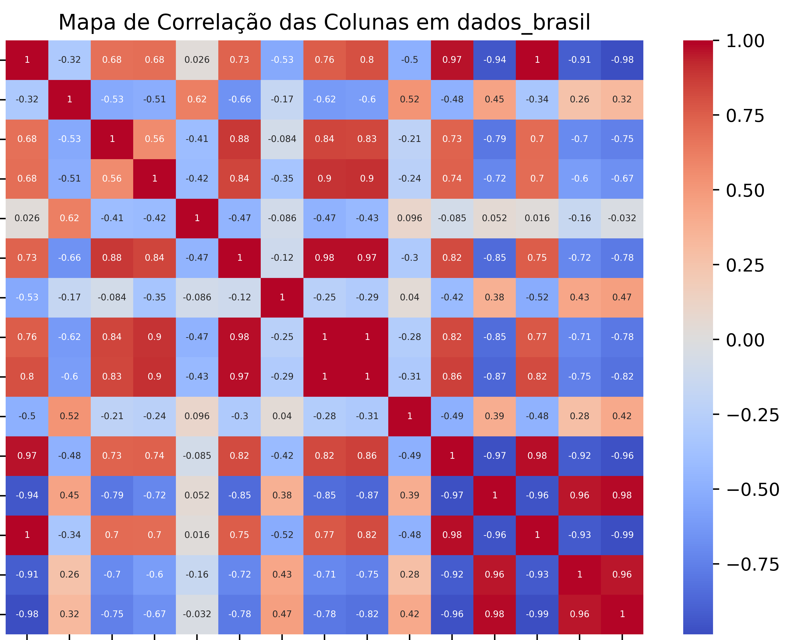

# Rede neural para previsão do PIB de países da América do Sul

**Tito. L Dhayse**

## Abstract
O Produto Interno Bruto é uma medida importante e amplamente utilizada para avaliar o desempenho econômico de um país, já que serve como indicador do crescimento e do bem-estar econômico do mesmo. Além disso, é uma métrica valiosa para auxiliar no planejamento socioeconômico da nação. Com isso, nesse trabalho, há o entendimento dessa importância ao propor o uso de redes neurais artificiais para a previsão do PIB dos países da América do Sul. O objetivo da rede criada é o aprendizado de padrões e relações complexas utilizando dados históricos e conseguir fornecer previsões mais precisas do que os modelos tradicionais, normalmente feita por humanos. Sob tal ótica, foi possível atingir um patamar de aprendizado satisfatório pela rede usando o método de backpropagation em variáveis de entrada cuidadosamente selecionadas no banco de dados escolhido, e seus dados devidamente analisados em diversas fases de pré-processamento, onde foram tratados, selecionados, normalizados e separados em treino, validação e teste. Assim, foi possível obter resultados palpáveis e que podem ser utilizados em diversas aplicações diferentes para o planejamento econômico dos países da América do Sul.

## Keywords
Redes Neurais Artificiais, Inteligência Artificial, Economia, PIB.

# Introdução

Prever de forma precisa e confiável o PIB é uma questão crítica para o
desenvolvimento econômico dos países da América do Sul. Neste contexto,
o uso de redes neurais artificiais demonstra-se como uma ferramenta
poderosa para alcançar essa previsão, fornecendo uma contribuição direta
para o crescimento econômico e a estabilidade da região.

Esse estudo busca explorar o potencial das redes neurais artificiais
para estimar o PIB, com ênfase na América do Sul. Ao obter uma boa
estimativa do PIB com base nas redes neurais, os resultados deste estudo
têm implicações significativas para diversos setores. Notavelmente, a
previsão precisa do desempenho econômico futuro torna-se um atrator
crucial para investimentos no mercado financeiro. Além disso, torna-se
essencial para o planejamento empresarial, permitindo que as empresas
antecipem e planejem suas operações, estoques, produções e investimentos
com base em uma métrica confiável e atualizada.

Um aspecto relevante é a capacidade dessa previsão em auxiliar na
avaliação de políticas econômicas em vigor, fornecendo *insights* sobre
seus possíveis resultados, sejam eles positivos ou negativos. Dessa
forma, as autoridades governamentais podem tomar decisões mais
informadas e direcionadas para impulsionar o crescimento econômico e a
estabilidade na região.

Com este trabalho, espera-se contribuir para o avanço do conhecimento na
área de previsão econômica utilizando redes neurais artificiais,
oferecendo uma abordagem inovadora para impulsionar o desenvolvimento
sustentável e o progresso econômico na América do Sul. Ao longo deste
artigo, serão apresentados os métodos e dados utilizados, bem como as
análises dos resultados obtidos, visando proporcionar uma visão
abrangente sobre a aplicabilidade e eficácia dessa abordagem.

O restante deste artigo está organizado de modo que na seção 2 é feito
um breve revisão sobre análise econômica e redes neurais.
Posteriormente, na seção 3 é apresentado a metodologia do estudo, na
seção 4 é feita uma análise dos resultados e, por fim, na seção 5 as
considerações finais desse estudo.

# Revisão da literatura

## Fundamentos de análise econômica

A análise econômica é um campo fundamental para compreender o
funcionamento das atividades econômicas de um país ou região. Seu
objetivo é estudar os diversos fatores que influenciam a economia, a fim
de fornecer informações valiosas para tomadas de decisões em políticas
governamentais, estratégias empresariais e investimentos. Dentre os
principais indicadores econômicos, o Produto Interno Bruto (PIB) se
destaca como uma medida-chave para avaliar o desempenho e o crescimento
econômico de uma nação.

O Produto Interno Bruto é uma métrica que representa o valor total de
todos os bens e serviços produzidos em um país durante um determinado
período, geralmente trimestral ou anual. Ele engloba tanto a produção
interna de bens e serviços para o consumo doméstico, quanto as
exportações líquidas (diferença entre exportações e importações). O PIB
é um indicador amplo e abrangente, refletindo a atividade econômica em
todos os setores, desde agricultura e indústria até serviços financeiros
e tecnologia.

## Redes neurais MLP

Na análise econômica, as Redes Neurais Artificiais, e mais
especificamente as *Multilayer Perceptrons* (MLPs), têm se destacado
como uma ferramenta poderosa para a modelagem e previsão de séries
temporais econômicas. As MLPs são um tipo de rede neural *feedforward*
composta por camadas de neurônios interconectados, onde cada neurônio em
uma camada está conectado a todos os neurônios da camada seguinte. Essa
arquitetura permite que as MLPs capturem relações complexas entre
variáveis econômicas, tornando-as capazes de aprender padrões não
lineares nos dados. Além disso, as MLPs possuem a capacidade de se
adaptar e aprender a partir de dados históricos, o que as torna ideais
para tarefas de previsão econômica. Através de um processo de
treinamento utilizando técnicas de otimização, como o algoritmo de
*backpropagation*, as MLPs ajustam os pesos das conexões entre os
neurônios para minimizar o erro de previsão e, assim, aprimorar a
capacidade de generalização do modelo. Essa flexibilidade e capacidade
de aprendizado tornam as redes MLPs uma escolha promissora para a
previsão do Produto Interno Bruto (PIB) e outras variáveis econômicas
importantes, contribuindo significativamente para o avanço da análise
econômica e tomada de decisões fundamentadas em cenários complexos.

## Trabalhos relacionados

Nesta seção, destacamos alguns trabalhos relevantes relacionados ao tema
de previsão econômica utilizando redes neurais artificiais.

1\. No estudo realizado por , foi apresentada uma introdução abrangente
sobre o uso de redes neurais artificiais na previsão de séries
econômicas. O artigo aborda conceitos fundamentais de redes neurais e
sua aplicação na análise de dados econômicos, fornecendo uma base
teórica para pesquisas posteriores.

2\. Em , foi proposto um modelo de previsão econômica regional baseado
em uma rede neural convolucional profunda e *big data*. O estudo enfoca
a análise econômica em nível regional e utiliza uma arquitetura de rede
convolucional para capturar padrões complexos nos dados econômicos,
resultando em previsões mais precisas.

3\. O trabalho de propõe uma abordagem de previsão de tendências de
indicadores econômicos em séries temporais, combinando uma rede neural
recorrente com indicadores líderes. Essa estratégia visa melhorar a
capacidade de previsão ao incorporar informações adicionais de
indicadores econômicos importantes.

4\. Em , os autores exploram o uso da análise de componentes
independentes (ICA) e regressão de vetores de suporte (SVR) para a
previsão de séries temporais financeiras. Essa abordagem inovadora visa
lidar com a complexidade e a volatilidade dos dados financeiros.

5\. Em , é apresentada uma revisão abrangente sobre modelos de *machine
learning* para previsão de séries temporais financeiras. O estudo aborda
diversas técnicas e algoritmos utilizados na previsão de indicadores
econômicos, fornecendo uma visão geral das abordagens mais eficazes e
suas aplicações.

Esses trabalhos oferecem contribuições significativas para a área de
previsão econômica utilizando redes neurais artificiais, abrangendo
diferentes enfoques e metodologias para melhorar a precisão e a eficácia
das previsões econômicas.

# Metodologia

Para realizar a previsão do Produto Interno Bruto (PIB) em países da
América do Sul, adotamos uma abordagem baseada em redes neurais
artificiais, mais especificamente o modelo de *Perceptron Multicamadas*
(MLP). A escolha das MLPs se deve à sua capacidade de aprendizado a
partir de dados históricos e sua habilidade em capturar relações não
lineares complexas nos dados econômicos.

## Descrição dos dados e fontes

O conjunto de dados utilizado para o treinamento e teste do modelo foi
coletado de fontes oficiais . Após o tratamento inicial, a base de dados
usada possuía 15 colunas de dados, incluindo o dado alvo (PIB). Essa
banco de dado, posteriormente ao processamento e análise foram
selecionados duas colunas: "Utilização de água doce (% dos recursos
internos)" e "Emissão de *C**O*2 (% toneladas métricas per
capita)". A escolha foi baseada no mapa de calor visto na Figura
<a href="#fig:mapa" data-reference-type="ref"
data-reference="fig:mapa">1</a>.

<figure id="fig:mapa">

<figcaption>Mapa de calor do banco de dados referente ao
Brasil.</figcaption>
</figure>

Os dados abrangeram um período de 21 anos (2000 a 2020), com dados
anuais do PIB. Foi realizado uma análise cuidadosa dos dados para
garantir sua qualidade e consistência, com tratamentos dos dados nulos e
vazios. Além disso, os dados foram coletados para os 12 países da
América do Sul (a Guiana Francesa não entrou por ser uma região
administrativa da França, portanto não considerada um país).

Para o estudo inicial, concentramos nossas análises nos dados do Brasil,
a fim de obter uma visão mais detalhada e específica sobre o cenário do
país em questão.

## Pré-processamento dos dados

Antes de alimentar os dados à rede neural, foram realizadas etapas de
pré-processamento. Os dados foram divididos em três conjuntos: treino,
validação e teste, utilizando a função `train_test_split` da biblioteca
Scikit-learn. Em seguida, os dados de entrada (características `X`)
foram normalizados utilizando o `MinMaxScaler` para colocá-los na mesma
escala, melhorando o treinamento e desempenho da rede neural. Além
disso, os dados de saída (`y`) também foram normalizados para estarem na
mesma escala que os dados de entrada, visando a melhoria do treinamento.
No final do código, após a predição usando o modelo treinado, os valores
de saída são revertidos para a escala original usando o
`scaler_y.inverse_transform`, para que possamos interpretar os
resultados na unidade original da variável alvo. Vale notar que uma
métrica personalizada, `R2`, também é utilizada para avaliar o
desempenho do modelo durante o treinamento.

## Arquitetura da rede neural

Para evitar problemas de *overfitting* e avaliar a capacidade de
generalização do modelo, dividimos o conjunto de dados em conjuntos de
treinamento, validação e teste, utilizando a técnica de validação
cruzada. A otimização dos hiperparâmetros da rede neural foi realizada
por meio de uma busca sistemática utilizando a técnica de *Grid Search*.

A arquitetura da rede foi composta por quatro camadas: uma camada de
entrada com 12 variáveis, uma camada oculta com 50 neurônios, uma
segunda camada oculta com 15 neurônios e uma camada de saída com um
único neurônio para prever o valor do PIB. Essa estrutura pode ser
observada na Figura <a href="#fig:model" data-reference-type="ref"
data-reference="fig:model">2</a>.

<figure id="fig:model">

<figcaption>Resumo da arquitetura do modelo usado.</figcaption>
</figure>

Para treinar o modelo, utilizamos o algoritmo de *backpropagation* com a
função de ativação ReLU nas camadas ocultas e uma função de ativação
linear na camada de saída. A função de perda utilizada foi o erro médio
quadrático (MSE) para avaliar o desempenho do modelo durante o
treinamento.

Por fim, realizamos experimentos com diferentes configurações da rede,
ajustando os hiperparâmetros e analisando a convergência e o desempenho
do modelo em relação aos dados de teste. Os resultados foram avaliados
utilizando métricas de desempenho, como o erro absoluto médio (MAE),
erro médio percentual (MAPE) e o coeficiente de determinação (R²), para
verificar a precisão das previsões e a capacidade de generalização do
modelo.

# Resultados e Discussão

optamos por focar nossas análises exclusivamente nos dados do Brasil.
Essa decisão foi tomada com o objetivo de adquirir uma compreensão mais
aprofundada e específica sobre o contexto e as características do país
em questão. Ao concentrarmos nossos esforços em um único país, pudemos
fazer análises mais específicas para tal país.

No entanto, vislumbramos ampliar nossa pesquisa para incluir os demais
países presentes no banco de dados. Ao abranger uma amostra mais ampla
de países da América do Sul, poderemos comparar e contrastar diferentes
realidades socioeconômicas, ambientais e demográficas, obtendo uma
perspectiva regional mais abrangente. Essa expansão geográfica permitirá
identificar semelhanças e diferenças entre os países, bem como entender
o panorama geral da região.

Como podemos observar significativas diferenças no mapa de calor visto
na Figura <a href="#fig:mapa2" data-reference-type="ref"
data-reference="fig:mapa2">3</a> do banco de dados referente à todos
países da América do Sul ao comparar com a Figura
<a href="#fig:mapa" data-reference-type="ref"
data-reference="fig:mapa">1</a>, que apresenta apenas os dados do
Brasil.

<figure id="fig:mapa2">

<figcaption>Mapa de calor do banco de dados.</figcaption>
</figure>

Os resultados obtidos neste estudo usando o modelo de rede neural
proposto apresentaram um desempenho promissor na tarefa de regressão. A
arquitetura da rede neural, composta por duas camadas ocultas com
ativações ReLU, mostrou-se adequada para capturar as características
complexas do conjunto de dados. O pré-processamento dos dados, incluindo
a divisão em conjuntos de treino, validação e teste, juntamente com a
normalização das características de entrada e saída, contribuiu para
melhorar a convergência do treinamento e a generalização do modelo. As
métricas de avaliação do modelo, incluindo o erro absoluto médio (MAE),
o erro quadrático médio (MSE), o erro percentual absoluto médio (MAPE) e
o coeficiente de determinação (R2), demonstraram resultados
satisfatórios no conjunto de teste.

## Análise dos resultados obtidos

Pela figura <a href="#fig:loss" data-reference-type="ref"
data-reference="fig:loss">4</a> podemos observar a métrica MSE (Erro
Quadrático Médio) durante o treinamento com validação. Por volta da
época 50 jpa obteve uma estabilidade.

<figure id="fig:loss">

<figcaption>Gráfico de treino e validação com parâmetro de loss igual a
MSE.</figcaption>
</figure>

Agora fazendo uma análise para os dados de teste temos:

1.  MAE: 1.76e+11

2.  MAPE: 14.56

3.  R2: 0.89

# Considerações Finais

## Conclusão

Em conclusão, o trabalho foi capaz de demonstrar com sucesso o uso de
redes neurais artificiais como uma abordagem útil e promissora para
prever o Produto Interno Bruto dos países do Brasil, ressaltando a
importância dessas redes de lidar com relacionamentos não lineares entre
os dados e capturar interações complexas entre variáveis econômicas para
previsões cada vez mais precisas de cada região. O resultado das
métricas ainda não é ideal, mostrando que o estudo ainda precisa passar
por melhorias.

# Bibliografía 

M. S. Portugal, L. G. L. Fernandes, and others, "Redes neurais
artificiais e previsão de séries econômicas: uma introdução," Nova
Economia, vol. 6, no. 1, 1996, pp. 51–73. Economics Department,
Universidade Federal de Minas Gerais (Brazil).

S. Tuo, T. Chen, H. He, Z. Feng, Y. Zhu, F. Liu, and C. Li, "A regional
industrial economic forecasting model based on a deep convolutional
neural network and big data," Sustainability, vol. 13, no. 22, 2021, pp.
12789. MDPI.

J. M. Wu, M. H. Tsai, C. C. Cheng, and M. E. Wu, "Predict the trend of
economic indicators in time series based on recurrent neural network
combined with leading indicators," Journal of Intelligent & Fuzzy
Systems, Preprint, 2022, pp. 1–11. IOS Press.

C. J. Lu, T. S. Lee, and C. C. Chiu, "Financial time series forecasting
using independent component analysis and support vector regression,"
Decision Support Systems, vol. 47, no. 2, 2009, pp. 115–125. Elsevier.

Y. Tang, Z. Song, Y. Zhu, H. Yuan, M. Hou, J. Ji, C. Tang, and J. Li, "A
survey on machine learning models for financial time series
forecasting," Neurocomputing, vol. 512, 2022, pp. 363–380. Elsevier.

"The Atlas of Economic Complexity," \[Online\]. Disponível:
<https://atlas.cid.harvard.edu/>.

A. G. Rossi, "Predicting stock market returns with machine learning,"
Georgetown University, 2018.

M. Abe and H. Nakayama, "Deep learning for forecasting stock returns in
the cross-section," in Advances in Knowledge Discovery and Data Mining:
22nd Pacific-Asia Conference, PAKDD 2018, Melbourne, VIC, Australia,
June 3-6, 2018, Proceedings, Part I 22, 2018, pp. 273–284. Springer.

P. H. Franses and K. van Griensven, "Forecasting exchange rates using
neural networks for technical trading rules," Studies in Nonlinear
Dynamics & Econometrics, vol. 2, no. 4, 1998, pp. 51–73. De Gruyter.

G. O. Young, “Synthetic structure of industrial plastics,” in
*Plastics,* 2nd ed., vol. 3, J. Peters, Ed. New York, NY,
USA: McGraw-Hill, 1964, pp. 15–64.

DataBank, "World Development Indicators," Junho 2023. \[Online\].
Disponível:
<https://databank.worldbank.org/source/world-development-indicators>.

BCB, "Estatísticas," Junho 2023. \[Online\]. Disponível:
<https://www.bcb.gov.br/estatisticas>.

IMF, "IMF Data," 2022. \[Online\]. Disponível:
<https://www.imf.org/en/Data>.

OECD, "The OECD & LAC," 2023. \[Online\]. Disponível:
<https://www.oecd.org/latin-america/data/>.
